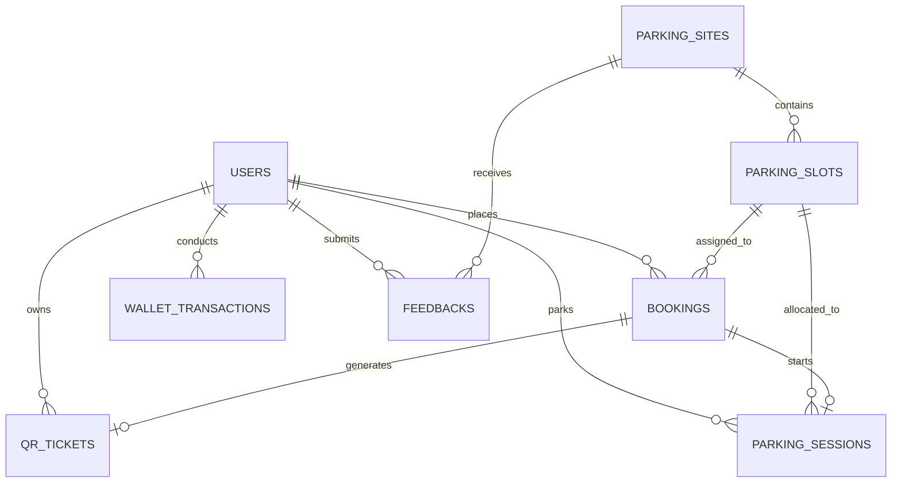

# Database Design Documentation

This directory contains the SQL Server database scripts for the QR Parking Booking System.

## Files

- [schema.sql](file:///d:/on/database/schema.sql): Script containing the DDL statements to create all tables, relationships, and check constraints.
- [seed.sql](file:///d:/on/database/seed.sql): Script containing sample seed data matching the mock dataset.

## Entity Relationship Diagram (ERD)

The following Mermaid diagram represents the relational model:

## Relational Schema & Tables

### 1. `Users`
Stores account profiles for all roles (`Admin`, `Handler`, `User`).
- `UserId`: Unique alphanumeric identifier (Primary Key).
- `UserRole`: Restricted to `'Admin'`, `'Handler'`, or `'User'`.
- `WalletBalance`: Balance in VND (restricted to non-negative values).
- `UserStatus`: Controlled via check constraint (`'Active'`, `'Blocked'`).

### 2. `ParkingSites`
Stores geographic parking site locations.
- `Latitude` / `Longitude`: Coordinates for GPS calculations.
- `BaseRate`: Standard default site hourly rate.

### 3. `ParkingSlots`
Stores individual slots within parking sites.
- `SlotStatus`: Restricted via check constraint (`'Available'`, `'Reserved'`, `'Occupied'`, `'Maintenance'`).
- `UC_Site_SlotNumber`: Unique constraint ensures slot numbers are unique within a parking site.

### 4. `Bookings`
Tracks parking reservations.
- `BookingStatus`: Restricted via check constraint (`'Reserved'`, `'Active'`, `'Completed'`, `'Cancelled'`).

### 5. `QrTickets`
Tracks QR codes generated for bookings and user profiles.
- `QrType`: Either `'ParkingTicket'` or `'UserProfile'`.

### 6. `ParkingSessions`
Logs active and completed parking entry/exit events.
- Tracks `EntryTime` and `ExitTime` (null if active).
- `HandlerId`: Relates to the Gate Handler who scanned the vehicle.

### 7. `WalletTransactions`
Logs card and cash top-up records.

### 8. `Feedbacks`
Logs user reviews for sites.

---
## Indexes & Constraints
- **Foreign Keys**: Enforced on all relationships to preserve referential integrity.
- **Check Constraints**: Used to validate domains for enumerations (e.g. `UserRole`, `SlotStatus`, `BookingStatus`).
- **Unique Indexes**: Implemented on `Users(Email)`, `Bookings(QrCode)`, `QrTickets(QrValue)` and composite key `ParkingSlots(SiteId, SlotNumber)`.
