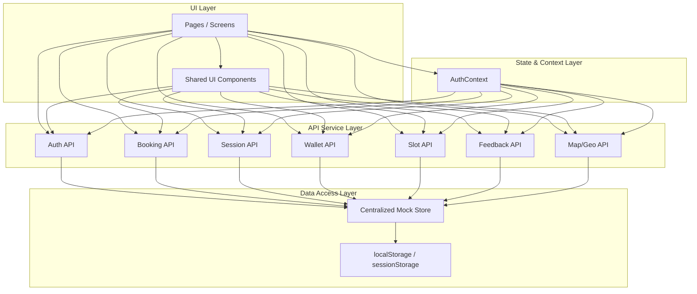
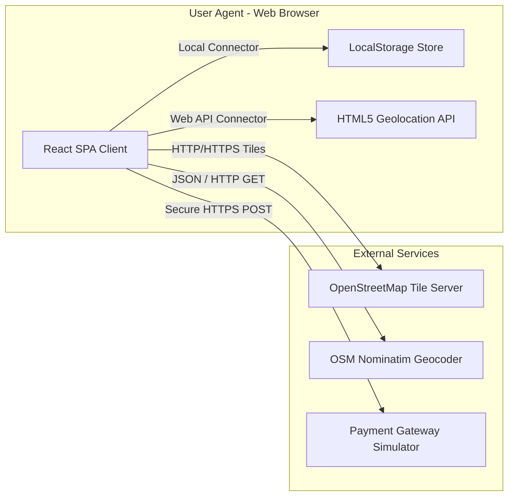

# Software Architecture Documentation

This document describes the software architecture for the QR Parking Booking System, outlining the layout, design patterns, components, and deployment strategy.

---

## 1. Module View (Layered Architecture)

The system is structured as a client-side Single Page Application (SPA) using a layered modular architecture. The modules are separated by responsibility to ensure low coupling and high cohesion.

### Module Decomposition Diagram



### Module Descriptions

- **UI Layer (`src/components/`, `src/pages/`)**: Renders HTML/CSS views. Components are functional React elements styled with vanilla CSS/Tailwind.
- **State & Context Layer (`src/context/`)**: Manages authentication and role-based permissions (`useAuth`), making it accessible to all routing components.
- **API Service Layer (`src/api/`)**: Simulates asynchronous network requests. Exposes asynchronous operations for CRUD management.
- **Data Access Layer (`src/api/mockStore.js`)**: Holds the local system state in memory, synchronizing it with `localStorage` to ensure persistence across reloads.

---

## 2. Component & Connector (C&C) View

The Component & Connector view illustrates how runtime components communicate using different protocols and connectors.

### C&C Diagram



### Connectors and Communication Protocols

- **Local Connector (Direct function calls)**: Connects UI components to the Mock API and the Centralized Store.
- **Web API Connector (Browser Bindings)**: Accesses HTML5 GPS coordinates directly on the user's mobile device or PC.
- **HTTP/HTTPS Tile Connector**: Leaflet triggers standard tile fetch requests to OpenStreetMap for rendering interactive layouts.
- **JSON / HTTP Geocoding (REST API)**: Nominatim reverse-geocodes current GPS coordinates to readable address names.
- **Secure payment Simulation**: Recharging calls the simulator that validates card formats.

---

## 3. Deployment View

This view displays the physical topology of the deployment environment, specifying how components map to server nodes.

### Deployment Diagram

```mermaid
deploymentNode "User Hardware Node" {
    deploymentNode "Browser Environment" {
        node "React SPA Runtime" as client
        database "Browser Local Storage" as localdb
        node "HTML5 Geolocation API" as gps
    }
}

deploymentNode "Cloud Delivery CDN (Vite Static Host)" {
    artifact "Static Web Assets (JS, CSS, HTML)" as staticfiles
}

deploymentNode "OpenStreetMap Service Cloud" {
    node "Nominatim Geocoding Engine" as geoengine
    node "Tile Distribution Server" as tileserver
}

client -- reads --> staticfiles : HTTP/GET (Initial Load)
client -- persists --> localdb : LocalStorage API
client -- requests coords --> gps : Web API
client -- fetches maps --> tileserver : HTTPS / WMS Tiles
client -- reverse geocodes --> geoengine : HTTPS / JSON
```

### Execution Environment Specifications

- **Static Hosting**: The application compiles into an optimized bundle using Vite. This is deployed onto static CDNs (e.g. Vercel, Netlify, or AWS S3).
- **Client Processing**: Execution occurs fully on client machines, minimizing backend overhead.
- **State Lifecycle**: Local storage retains parking database records. If the user clears browser data, state falls back to seed configurations.
